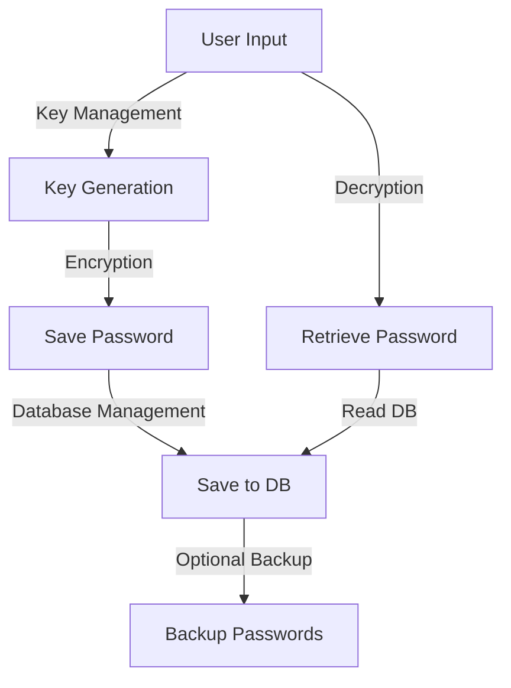

# Password Manager

**A secure and user-friendly password management tool for managing and encrypting passwords effortlessly.**

---

## 🔑 Features at a Glance

- **Secure Encryption**: Uses the `cryptography.fernet` module for password encryption and decryption.
- **Automatic Password Generation**: Generate secure passwords with customizable options.
- **Domain Management**: Save, retrieve, list, and delete password entries associated with specific domains.
- **Backup System**: Create backups of your stored passwords.
- **Simple Key Management**: Easily create and archive encryption keys for secure password management.

---

## 🏗️ Visual Overview



---

## 🚀 Installation and Setup

### Prerequisites
- Python 3.8 or higher
- Virtual environment (recommended)

### Step 1: Clone the Repository
```bash
git clone https://github.com/Caio-Felice-Cunha/Password-Manager.git
cd Password-Manager
```

### Step 2: Install Dependencies
```bash
pip install -r requirements.txt
```
The only third-party dependency is `cryptography` (used for Fernet encryption).

### Step 3: Run the Password Manager
```bash
python main.py
```
Run this from the repository root. `main.py` is a thin entry point around the
interactive menu in `templates/template.py`.

### Optional: Load demo data
The encrypted database and key files are never committed (a password manager
must not ship key material). To populate a fresh checkout with a few demo
entries so you can try the retrieve, list, delete, and backup flows:
```bash
python seed.py
```
It prints a one-time demo encryption key. Use that key when the menu asks for
one (option 2, "Retrieve password"). On a completely fresh checkout, choosing
"Save new password" with an empty database instead generates and archives a new
key for you under `keys/`.

---

## Usage Guide

1. Launch the application using `python main.py`.
2. Follow the on-screen menu to:
   - **Save a New Password**: Encrypt and save a password for a specific domain.
   - **Retrieve a Password**: Decrypt and display stored passwords.
   - **List All Domains**: View all saved domains in your password manager.
   - **Delete a Password**: Remove an entry by domain.
   - **Create a Backup**: Save all passwords to a secure backup file.

---

## 🤝 Contribution Guide

### Development Environment Setup
1. Fork the repository and clone it:
   ```bash
   git clone https://github.com/your-username/Password-Manager.git
   cd Password-Manager
   ```
2. Create a virtual environment:
   ```bash
   python -m venv venv
   source venv/bin/activate  # On Windows, use `venv\Scripts\activate`
   ```
3. Install dependencies:
   ```bash
   pip install -r requirements.txt
   ```

### Running Tests
The test suite uses `pytest` and covers password generation/validation, the
encrypt/decrypt round trip, wrong-key handling, and the save/get/delete flow:
```bash
pip install pytest
python -m pytest
```

### Submitting Changes
1. Ensure your code follows the repository's style and passes tests.
2. Push changes to your fork and create a pull request.
3. Include a detailed description of your changes and their purpose.

---

## 🔍 How It Works

- **Key derivation**: A 25-character random string is drawn with Python's
  `secrets` module, hashed with SHA-256, and URL-safe base64 encoded into a
  32-byte Fernet key.
- **Encryption**: Each password is encrypted with `cryptography.fernet.Fernet`
  before being written to disk. Decryption requires the original key; a wrong
  key raises `InvalidToken` and the app reports it clearly.
- **Storage**: Entries are stored as JSON in `db/Password.json`. Keys live in
  `keys/` and backups in `backups/`. All three are gitignored so no secrets or
  user data enter version control.

---

## 🚧 Known Issues and Future Plans

### Known Issues
- **Single-key model**: All entries are encrypted under one key. Losing the key
  means losing access to the stored passwords; there is no recovery flow.
- **Local-only storage**: Data lives in plaintext-named JSON files on the local
  machine. There is no multi-device sync.

### Future Plans
- **Cross-Platform GUI**: Build a graphical interface for broader accessibility.
- **Cloud Synchronization**: Enable secure cloud-based backups.
- **Advanced Password Analysis**: Add features to analyze the strength of existing passwords.

---

## 📝 License

This project is licensed under the MIT License. See the `LICENSE` file for more details.

---

## 🎯 Credits
This project was developed as part of the "4 days 4 projects" initiative by [Pythonando](https://pythonando.com.br) on YouTube.